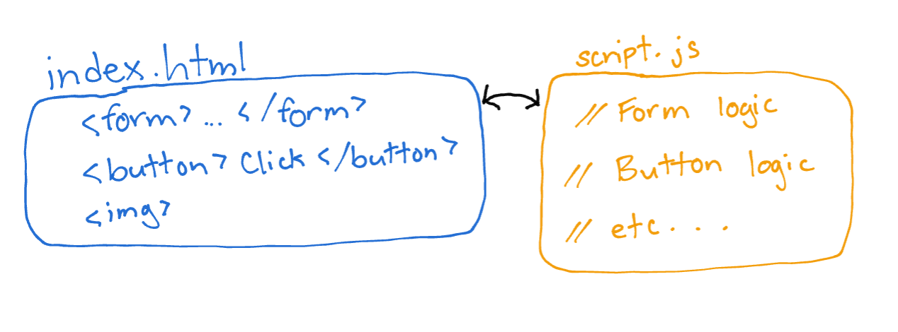
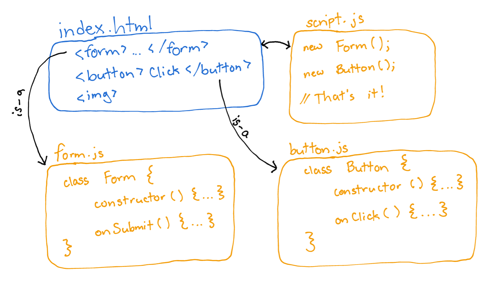

# ChainLink.js

A front-end methodology/framework that rejects traditional page scripting and implements OOP principles into front-end development. Creates modular, reusable components which handle their own logic and properties internally.

## The Problem

Why does object-oriented programming seem to translate so poorly to front-end web development? We spend so much time in Java and other C-based languages learning about classes, inheritance, design patterns, etc. But when a good ol’ web front-end needs to be built, most of those principles seem to be tossed out the window. Why?

A lot of this has to do with a paradigm I call “page-based scripting”. I don’t blame anyone for approaching JavaScript this way - especially for newcomers, it’s the most logical place to start.

Imagine a basic web setup: an index.html, style.css, and script.js. The HTML file is responsible for building the page structure, and outlines all the components: forms, buttons, images. The CSS file makes it all look pretty (we’ll just ignore that for now, there are plenty of resources out there to help with writing beautiful and maintainable styles). And the JavaScript file initializes functionality and responds to user input. script.js has the job of organizing and implementing functionality for the entire page.

So what’s the problem with this setup? Well, this “page-based scripting approach”:

1. Can get overly complex and out-of-hand very quickly as the page requires more and more functions

2. Is not modular or reusable - what happens when I want to use the same form on a different page?

3. Definitely does not follow the Single Responsibility Principle

## How ChainLink Solves the Problem

ChainLink uses JavaScript classes and instantiates objects linked with their front-end code. These objects are responsible for their own functionality, and only require a small amount of driver code to be initialized.

A ChainLink front-end architecture might look like this:

This diagram oversimplifies things a little, but hopefully the idea is clear. With this approach:

1. The functionality for a single page is instead separated into each page component. Files stay simple, small, and focused

2. The HTML template code and JavaScript functionality is modular and reusable (more on this later)

3. Each file is concerned with one responsibility, following (you guessed it) the Single Responsibility Principle

## How Does It Work?

ChainLink is built with the following frameworks:

- jQuery: to make working with the DOM a little easier
    - jQuery may be getting a little old, but it's reliable and makes common JavaScript tasks easier
- Handlebars: to enable HTML templating
    - Have you ever tried building DOM elements with jQuery? Not exactly a party

ChainLink provides two basic Template classes, which can be extended to create your own templates:

- InternalTemplate: use this class if your template Handlebars code will already be available in the page HTML.
- ExternalTemplate: use this class if your template Handlebars code will be stored in external files.